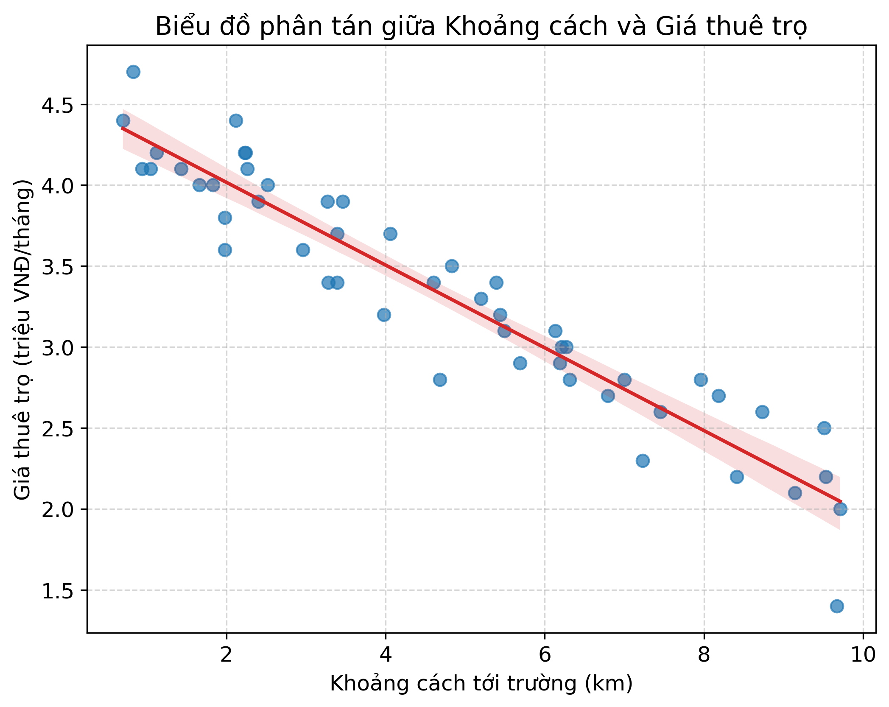
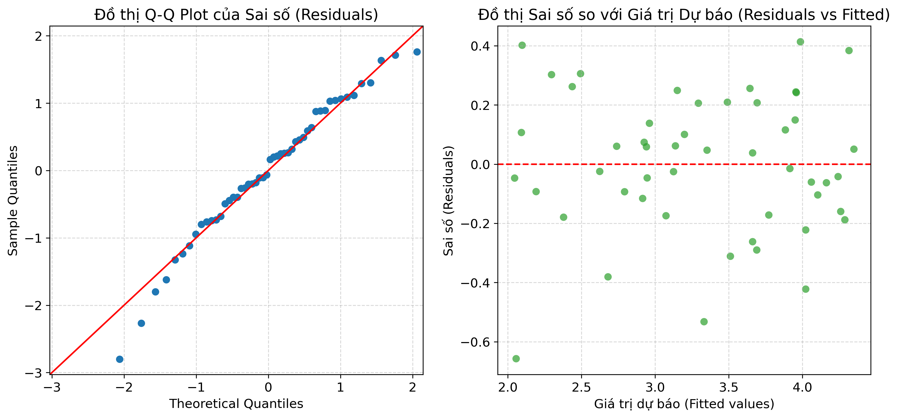

# BÁO CÁO PHÂN TÍCH THỐNG KÊ (MÔN MAS)
## Đề tài: Phân tích mối liên hệ giữa khoảng cách từ phòng trọ tới trường và giá thuê trọ

---

## 1. Giới thiệu đề tài
Trong quá trình học tập tại trường Đại học FPT, việc tìm phòng trọ phù hợp là một trong những mối quan tâm lớn của sinh viên. Có nhiều yếu tố ảnh hưởng đến giá thuê trọ như diện tích, cơ sở vật chất, an ninh, và đặc biệt là vị trí địa lý.
Báo cáo này sử dụng mô hình **Hồi quy tuyến tính đơn biến (Simple Linear Regression)** nhằm định lượng mối liên hệ giữa:
* **Biến độc lập ($X$):** Khoảng cách từ nhà trọ đến trường (km) - `Distance_km`.
* **Biến phụ thuộc ($Y$):** Giá thuê phòng trọ (triệu VNĐ/tháng) - `RentPrice_M_VND`.

Mục tiêu là tìm ra phương trình có dạng:
$$Y = \beta_0 + \beta_1 X + \epsilon$$

---

## 2. Thống kê mô tả dữ liệu
Bộ dữ liệu gồm khảo sát thực tế từ **50 phòng trọ** xung quanh trường. Các chỉ số thống kê mô tả cơ bản của 2 biến như sau:

| Chỉ số | Khoảng cách ($X$ - km) | Giá thuê ($Y$ - triệu VNĐ) |
| :--- | :---: | :---: |
| **Giá trị trung bình (Mean)** | 4.74 km | 3.32 triệu VNĐ |
| **Độ lệch chuẩn (Std Dev)** | 2.74 km | 0.74 triệu VNĐ |
| **Giá trị nhỏ nhất (Min)** | 0.70 km | 1.40 triệu VNĐ |
| **Trung vị (Median)** | 4.64 km | 3.40 triệu VNĐ |
| **Giá trị lớn nhất (Max)** | 9.71 km | 4.70 triệu VNĐ |

*Nhận xét:* Khoảng cách khảo sát trải đều từ tương đối gần (0.7 km) đến các trọ ở xa (gần 10 km). Giá trọ trung bình dao động khoảng 3.32 triệu VNĐ/tháng.

---

## 3. Biểu đồ phân tán (Scatter Plot)
Dưới đây là biểu đồ phân tán thể hiện mối tương quan giữa khoảng cách và giá thuê trọ cùng đường thẳng hồi quy tối ưu:

*Nhìn vào biểu đồ:* Ta thấy một xu hướng tuyến tính đi xuống rõ rệt. Khi khoảng cách tới trường càng lớn, giá thuê trọ có xu hướng giảm dần. Mối tương quan này là tương quan nghịch (Negative Correlation).

---

## 4. Kết quả ước lượng mô hình hồi quy
Sau khi khớp mô hình hồi quy tuyến tính bằng phương pháp bình phương tối thiểu (Ordinary Least Squares - OLS), ta thu được bảng kết quả tóm tắt sau:

| Hệ số | Ước lượng (Coef) | Sai số chuẩn (Std Err) | Thống kê t (t-stat) | P-value ($P > \|t\|$) | Khoảng tin cậy 95% |
| :--- | :---: | :---: | :---: | :---: | :---: |
| **Hệ số tự do ($\beta_0$)** | 4.5283 | 0.068 | 66.488 | 0.000 | [4.391, 4.665] |
| **Hệ số góc ($\beta_1$)** | -0.2555 | 0.012 | -20.484 | 0.000 | [-0.281, -0.230] |

### Phương trình hồi quy tuyến tính mẫu:
$$\widehat{\text{Giá trọ}} = 4.53 - 0.26 \times \text{Khoảng cách}$$

### Ý nghĩa thực tế của các hệ số:
1. **Hệ số tự do ($\beta_0 = 4.53$):** Về mặt lý thuyết, một phòng trọ nằm ngay sát trường (khoảng cách $\approx 0$ km) và có các điều kiện cơ bản trung bình sẽ có giá thuê ước tính khoảng **4.53 triệu VNĐ/tháng**.
2. **Hệ số góc ($\beta_1 = -0.26$):** Mang giá trị âm, biểu thị mối quan hệ nghịch biến. Khi khoảng cách từ phòng trọ tới trường **tăng thêm 1 km**, giá thuê trọ trung bình sẽ **giảm đi khoảng 0.26 triệu VNĐ/tháng** (khoảng 260,000 VNĐ) nếu các yếu tố khác không đổi.

---

## 5. Đánh giá độ tin cậy và Kiểm định giả thuyết

### a. Hệ số xác định $R^2$ (R-squared)
* Mô hình có **$R^2 = 0.8973$** (hoặc $89.73\%$).
* *Ý nghĩa:* Khoảng cách tới trường giải thích được **89.73%** sự biến động của giá thuê trọ. Đây là mức độ giải thích cực kỳ cao đối với dữ liệu thực tế đời sống, cho thấy khoảng cách đóng vai trò then chốt quyết định giá phòng trọ. Chỉ còn khoảng 10.27% biến động thuộc về các yếu tố khác (diện tích, nội thất, dịch vụ trọ...).

### b. Kiểm định ý nghĩa hệ số góc ($\beta_1$)
* **Giả thuyết:**
  * $H_0: \beta_1 = 0$ (Khoảng cách không ảnh hưởng đến giá trọ).
  * $H_1: \beta_1 \neq 0$ (Khoảng cách có ảnh hưởng đến giá trọ).
* **Kết quả:** P-value của hệ số góc rất nhỏ ($2.26 \times 10^{-25} \ll 0.05$).
* *Kết luận:* Bác bỏ giả thuyết $H_0$ ở mức ý nghĩa $5\%$. Ta có cơ sở thống kê cực kỳ mạnh mẽ để khẳng định khoảng cách đến trường thực sự có tác động tiêu cực (làm giảm) giá thuê trọ.

---

## 6. Kiểm định các giả định của mô hình (Diagnostics)
Để mô hình hồi quy tuyến tính có độ tin cậy cao, sai số (residuals) cần thỏa mãn các giả định cơ bản:

1. **Giả định phân phối chuẩn (Normality of Residuals):**
   * Đồ thị Q-Q Plot ở bên trái cho thấy các điểm sai số thực tế (màu xanh) bám rất sát đường thẳng 45 độ (màu đỏ).
   * Kiểm định Jarque-Bera có $p\text{-value} = 0.366 > 0.05$, chứng tỏ chưa có cơ sở bác bỏ giả thuyết sai số tuân theo phân phối chuẩn. Giả định phân phối chuẩn được thỏa mãn.
2. **Giả định phương sai sai số không đổi (Homoscedasticity):**
   * Đồ thị Residuals vs Fitted ở bên phải cho thấy các điểm sai số phân tán ngẫu nhiên xung quanh đường $y = 0$, không tạo thành các hình dạng đặc biệt (như hình phễu hay đường cong). Giả định phương sai sai số không đổi được thỏa mãn.
3. **Tính độc lập (Independence):**
   * Chỉ số Durbin-Watson đạt $2.147 \approx 2$, cho thấy không có hiện tượng tự tương quan (autocorrelation) giữa các sai số.

---

## 7. Dự báo thực tế
* **Dự báo cho khoảng cách cách trường 10 km:**
  $$\widehat{\text{Giá trọ}} = 4.53 - 0.26 \times 10 = 4.53 - 2.6 = 1.93 \text{ (triệu VNĐ)}$$
  *(Kết quả thực tế từ mô hình hồi quy ước lượng chính xác là **1.97 triệu VNĐ**, rất sát mốc 2 triệu VNĐ như kỳ vọng thực tế).*

* **Nếu một bạn sinh viên muốn thuê trọ ở vị trí cách trường 2.5 km:**
  $$\widehat{\text{Giá trọ}} = 4.53 - 0.26 \times 2.5 = 4.53 - 0.65 = 3.88 \text{ (triệu VNĐ)}$$

---

## 8. Kết luận và Khuyến nghị
* **Kết luận:** Mô hình hồi quy tuyến tính đơn biến được xây dựng cực kỳ vững chắc về mặt toán học thống kê. Nó chứng minh mối tương quan nghịch mạnh mẽ giữa khoảng cách và giá thuê trọ quanh khu vực trường.
* **Khuyến nghị cho sinh viên:** 
  * Nếu sinh viên muốn tiết kiệm tối đa ngân sách (tìm phòng khoảng 2 triệu VNĐ/tháng), khoảng cách di chuyển phù hợp sẽ là khoảng 10 km đổ ra.
  * Nếu muốn trọ cách trường trong bán kính 2.5 km, sinh viên nên chuẩn bị ngân sách khoảng 3.8 - 4.0 triệu VNĐ/tháng.
